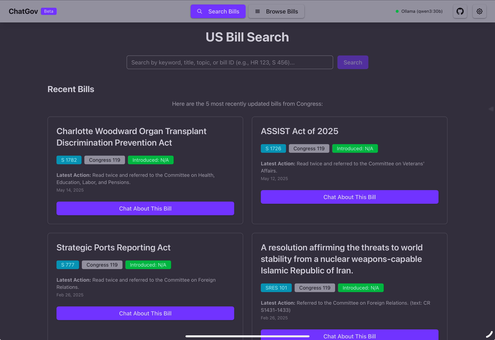
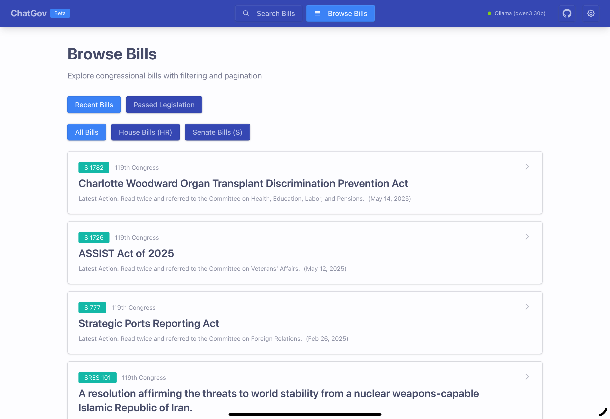
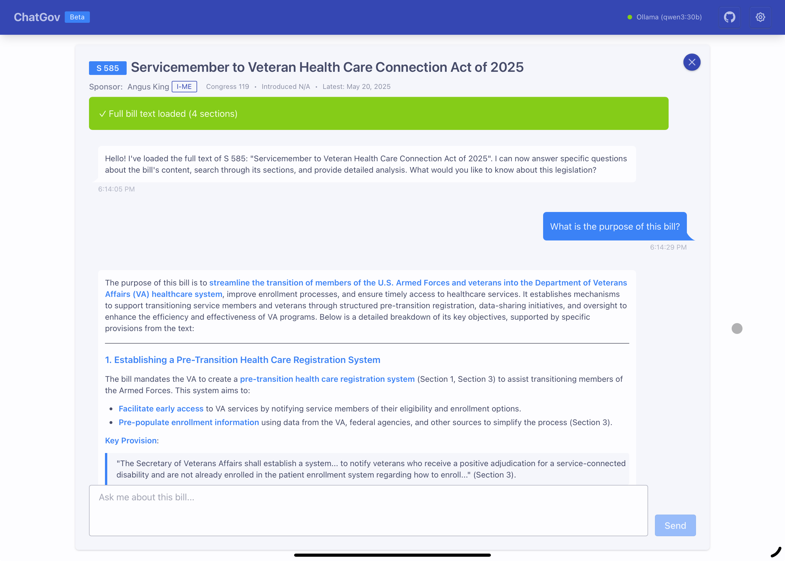

# ChatGov - US Bill Search & AI Chat

> **Built entirely by Claude Sonnet 4 using [Claude Code](https://claude.ai/code)** 🤖✨

A comprehensive webapp for searching US Congressional bills with AI-powered chat functionality. Features real-time Congress.gov data, passed legislation browsing, and intelligent bill analysis.

## Features

- 🏛️ **Bill Search**: Browse and search current Congressional bills with live Congress.gov data
- 📜 **Passed Legislation**: Browse enacted laws with server-side pagination and Congress filtering
- 🤖 **AI Chat**: Ask questions about specific bills using multiple AI providers
- 📄 **Full Text Analysis**: Download complete bill text with vector embeddings for semantic search
- 🔍 **Smart Search**: AI-powered similarity search through bill sections
- ⚙️ **Multiple AI Providers**: Support for OpenAI, Anthropic, xAI, and Ollama
- 📊 **Comprehensive Logging**: Detailed progress tracking for downloads and embeddings
- 🔒 **Server-side API**: Secure Congress API integration via Express backend
- 🎨 **Modern UI**: Built with FlyonUI v2.2.0 component library
- 📱 **Responsive Design**: Optimized for desktop, tablet, and mobile

## Screenshots

### Main Search Interface

*The main landing page featuring recent bills from Congress, search functionality, and clean navigation. Users can browse the latest legislative activity or search for specific bills by keyword.*

### Browse Passed Legislation

*Browse enacted laws and passed legislation with server-side pagination. Filter by Congress number and view comprehensive bill details including sponsors, dates, and status.*

### AI-Powered Bill Analysis

*Chat with AI about specific bills using multiple providers (OpenAI, Anthropic, xAI, Ollama). Ask questions about bill content, implications, and legislative process with intelligent responses.*

## Quick Start

### Development

1. **Install dependencies**:
   ```bash
   npm install
   ```

2. **Set up environment**:
   ```bash
   # Copy the example environment file
   cp .env.example .env
   # Edit .env and add your Congress API key (get one free at https://api.congress.gov/sign-up/)
   ```

3. **Run development servers**:
   ```bash
   # Start both frontend and backend with hot reload
   npm run dev:all
   
   # Or run separately:
   npm run server:dev  # Express server on port 3001
   npm run dev         # Vite client on port 5173
   ```

4. **Configure AI Settings**: 
   - Click the settings icon in the navbar
   - Add API keys for your preferred AI providers
   - Select embedding provider and models
   - Configure Congress number (defaults to 119th Congress)

### Production

#### Local Production Build
```bash
npm run build    # Build client files
npm run server   # Start production server on port 3001
```

#### Docker Deployment
```bash
# Quick deploy with Docker Compose
docker-compose up -d

# Or build and run manually
docker build -t chatgov .
docker run -p 3000:3000 -e CONGRESS_API_KEY=your_key chatgov
```

See [DEPLOYMENT.md](./DEPLOYMENT.md) for detailed production deployment instructions.

## Architecture

### Technology Stack
- **Frontend**: React 19 + TypeScript + Vite + FlyonUI v2.2.0
- **Backend**: Express.js server with TypeScript
- **AI Integration**: LangChain with multiple provider support
- **Styling**: Tailwind CSS 4 with FlyonUI semantic components
- **Data**: Live Congress.gov API integration with fallback mock data

### Application Structure
```
src/
├── components/          # React components
│   ├── BillSearch.tsx      # Main bill search interface
│   ├── ChatInterface.tsx   # AI chat with bill analysis
│   ├── PassedLegislation.tsx # Browse enacted laws
│   ├── Navbar.tsx          # Navigation with settings
│   └── SettingsPanel.tsx   # AI and Congress configuration
├── services/           # API and data services
│   ├── congressApi.ts     # Congress.gov API client
│   ├── aiService.ts       # Multi-provider AI integration
│   └── billTextService.ts # Bill content processing
└── types/              # TypeScript definitions

server/
├── app.ts              # Express server setup
├── routes/
│   ├── congress.ts        # Congress API proxy endpoints
│   └── billText.ts        # Bill content processing
```

### API Endpoints

#### Congress Data Endpoints
- `GET /api/congress/bills/search` - Search current bills by query
- `GET /api/congress/bills/recent` - Get recently updated bills
- `GET /api/congress/bills/:congress/:type/:number` - Get specific bill details
- `GET /api/congress/law/:congress/pub` - Get passed legislation for specific Congress
- `GET /api/congress/law/recent` - Get recent passed legislation across Congresses

#### Bill Content Endpoints
- `POST /api/bills/content` - Download and process bill text
- `GET /api/bills/:congress/:type/:number/content` - Get processed bill content
- `DELETE /api/bills/cache` - Clear server-side bill content cache

#### System Endpoints
- `GET /api/health` - Health check endpoint
- `GET /` - Serves the React application (production)

### Key Features

#### Live Congress.gov Integration
- Real-time data from the official Congress.gov API
- Automatic fallback to clearly labeled demo data when API is unavailable
- Support for current bills, recent updates, and passed legislation
- Server-side pagination for efficient data loading

#### AI-Powered Analysis
- Multi-provider AI support (OpenAI, Anthropic, xAI, Ollama)
- Vector embeddings for semantic bill search
- Intelligent question answering about bill content
- Configurable models and providers via settings panel

#### Modern User Experience
- Sticky navigation with integrated settings
- FlyonUI chat bubbles for conversation interface
- Responsive design optimized for all devices
- iOS Safari compatibility fixes
- Real-time search with loading states

## Environment Variables

| Variable | Description | Default | Required |
|----------|-------------|---------|----------|
| `CONGRESS_API_KEY` | Congress.gov API key | `demo_key` | Recommended |
| `PORT` | Server port | `3001` | No |
| `HOST` | Server host | `localhost` | No |
| `NODE_ENV` | Environment | `development` | No |

Get a free Congress API key at: https://api.congress.gov/sign-up/

## Development Notes

### Built with Claude Sonnet 4
This entire application was architected, designed, and implemented by Claude Sonnet 4 using [Claude Code](https://claude.ai/code). The development process showcased:

- **Rapid Prototyping**: Full-stack application built from concept to deployment
- **Modern Best Practices**: React 19, TypeScript, ESM modules, Docker containerization
- **API Integration**: Live Congress.gov data with proper error handling and fallbacks
- **UI/UX Design**: Professional interface with FlyonUI component library
- **Production Ready**: Complete with Docker deployment, health checks, and documentation

### Technology Choices
- **React 19**: Latest features including improved hydration and concurrent rendering
- **TypeScript**: Full type safety across frontend and backend
- **FlyonUI**: Semantic component library built on Tailwind CSS
- **LangChain**: Flexible AI integration supporting multiple providers
- **Express**: Minimal, fast backend serving both API and static files
- **Docker**: Containerized deployment with multi-stage builds

## Contributing

1. Fork the repository
2. Create a feature branch
3. Make your changes
4. Test with `npm run dev:all`
5. Build production with `npm run build`
6. Submit a pull request

## License

MIT License - see LICENSE file for details

---

*Powered by Claude Sonnet 4 and the official Congress.gov API*